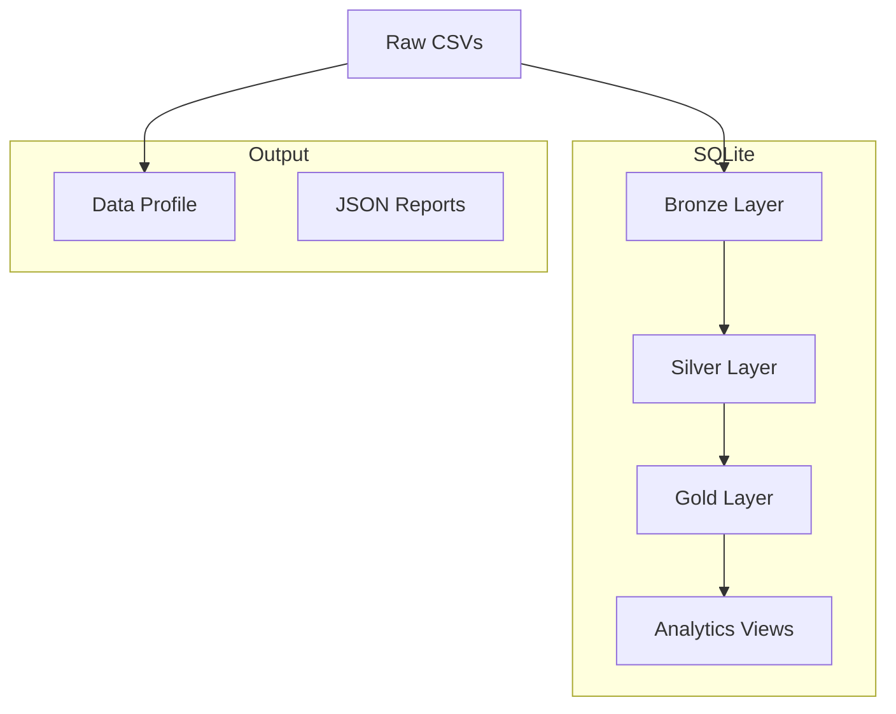

# Installation

- Create a venv using the python version stated in `.python-version`
- `python3 -m venv .venv`
- `source .venv/bin/activate`
- `pip install -r requirements.txt`

# Running Tests

- (From repo root) `pytest`

# Running the Pipeline

- `python3 main.py`

# Drop database

- `python3 scripts/rm_db.py`

# Architecture

# Schema Design, Productionalization, Other Improvements

Documented this throughout the main worker file `src/pipeline.py::pipeline` and `src/db/ddls.sql` as I was developing. Kindly read my notes there.
